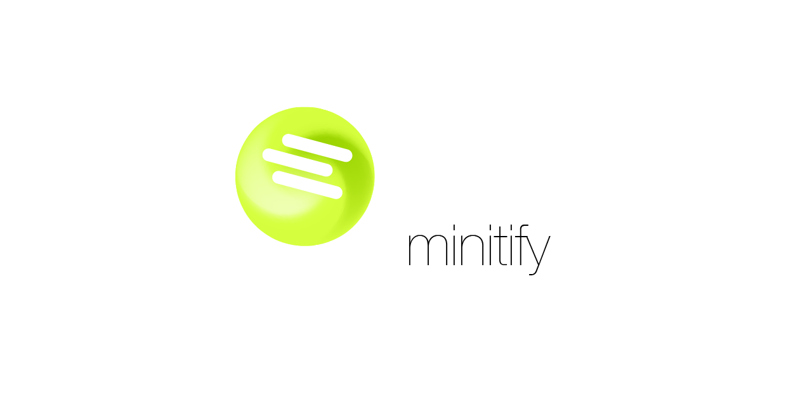
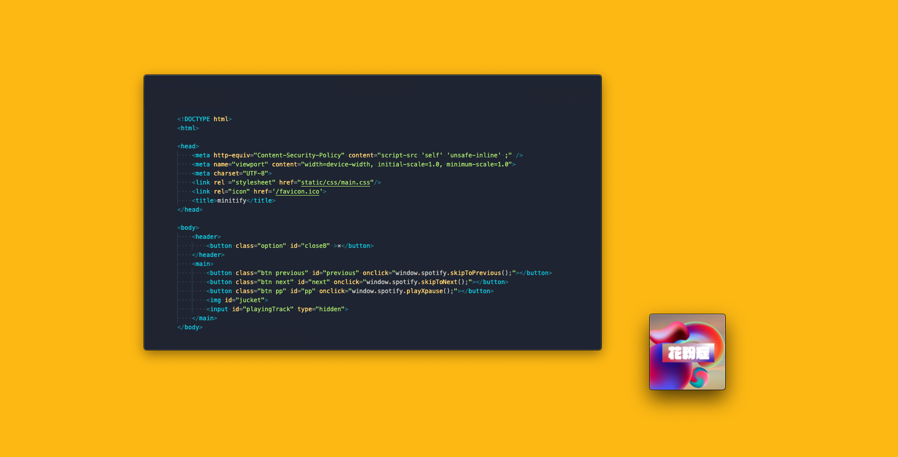

### image

### Included Libraries

(MIT License)
[electron](https://www.electronjs.org/)
[colorthief](https://lokeshdhakar.com/projects/color-thief/)
[node-vibrant](https://github.com/Vibrant-Colors/node-vibrant#readme)

### License

This software is released under the MIT License, see [LICENSE](LICENSE)